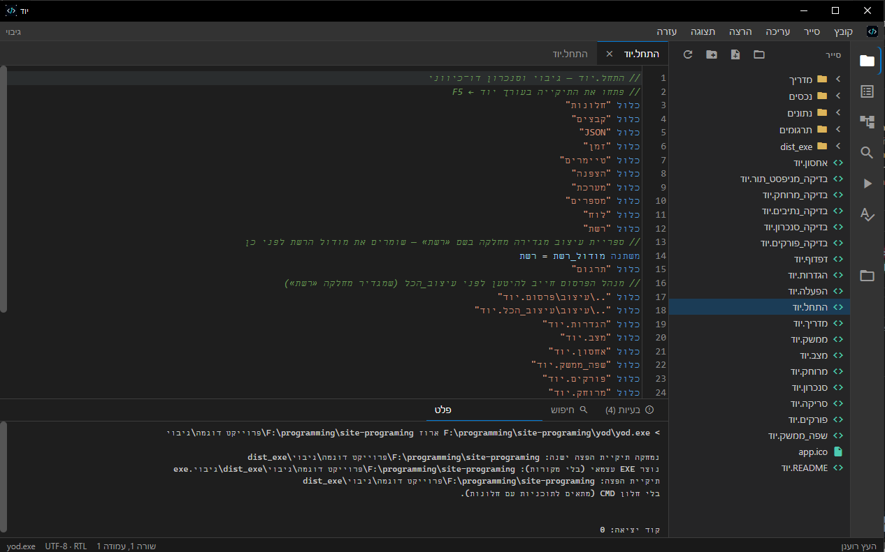
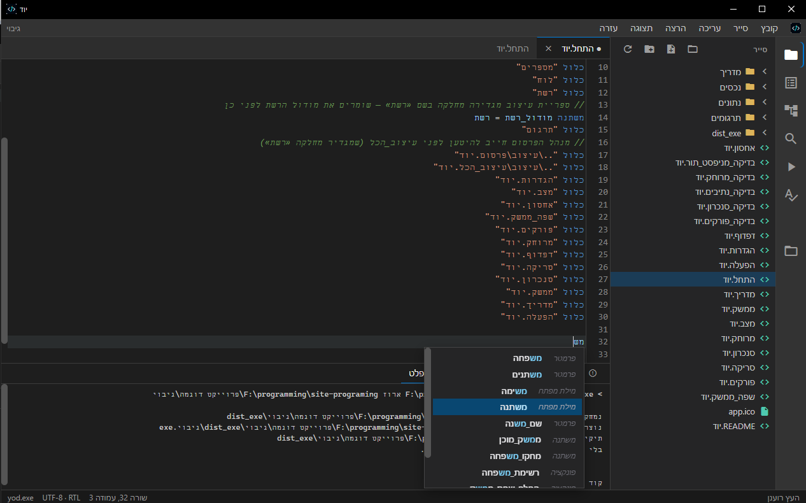
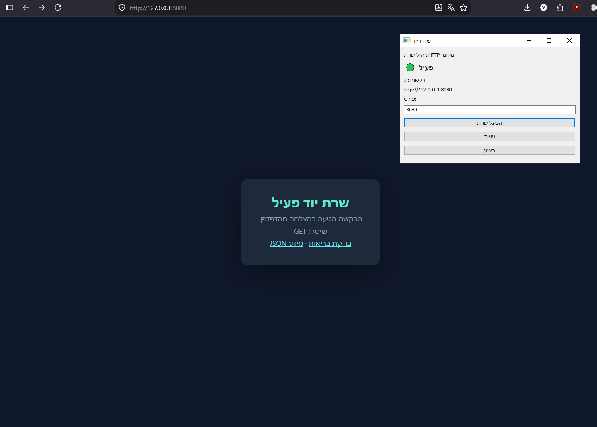
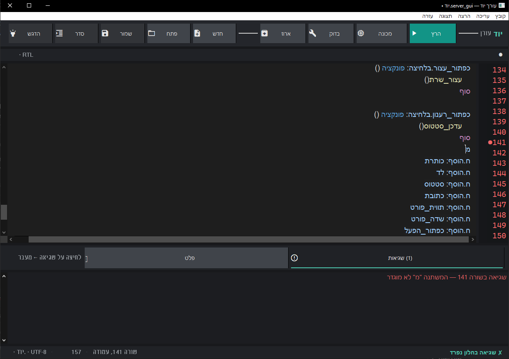

# יוד (Yod) — שפת תכנות בעברית

**יוד** היא שפת תכנות מודרנית בעברית: תחביר מימין־לשמאל, ספריות מובנות, עורך גרפי ל־Windows, ומכונה וירטואלית.

גרסה נוכחית: **0.56.1**

<p align="center">
  
</p>

<p align="center">
  
  &nbsp;
  
</p>

<p align="center">
  
</p>

---

## מה יש בריפו

| נתיב | תוכן |
|------|------|
| [`yod/`](yod/) | קוד המקור של השפה, העורך, הספריות והדוגמאות |
| [`מדריך שפת יוד/`](מדריך%20שפת%20יוד/) | מדריך HTML בעברית (תחביר + ספריות) |
| [`docs/screenshots/`](docs/screenshots/) | צילומי מסך של העורך והשרת |
| [`CONTRIBUTING.md`](CONTRIBUTING.md) | איך לבנות, לבדוק ולפתוח PR |
| [`info_program.html`](info_program.html) | יומן פיתוח וסטטוס פיצ׳רים |
| [`.cursorrules`](.cursorrules) | כללי עבודה לפיתוח השפה |

---

## התקנה ובנייה

### אפשרות א׳ — הורדה מוכנה (Windows)

ב־[Releases](https://github.com/ycohen888/Yod-language-programming/releases) יש `yod.exe` מוכן להורדה.
הגרסה האחרונה: **[v0.53.0](https://github.com/ycohen888/Yod-language-programming/releases/tag/v0.53.0)** (או העדכנית ב־Releases).
אין צורך ב־Go: מורידים, מריצים, ומתחילים.

### אפשרות ב׳ — בנייה מקוד המקור

דרוש [Go](https://go.dev/dl/) 1.22+ (הפרויקט משתמש ב־Go 1.26).

```powershell
cd yod
go build -o yod.exe ./cmd/yod
```

הרצה:

```powershell
.\yod.exe              # פותח את העורך (Windows)
.\yod.exe גרסה
.\yod.exe הרץ examples\shalom.יוד
.\yod.exe עזרה
```

---

## התחלה מהירה

קובץ `שלום.יוד`:

```יוד
הדפס("שלום עולם")

משתנה שם = קלט("מה שמך? ")
הדפס("היי, " + שם)
```

```powershell
.\yod.exe הרץ שלום.יוד
```

עוד דוגמאות בתיקייה [`yod/examples/`](yod/examples/).

### פרויקט (כמה קבצים)

הקובץ הראשי הוא תמיד `התחל.יוד`. שאר הקבצים נכללים עם `כלול`.
מדריך מפורט: [קובץ יחיד או פרויקט](מדריך%20שפת%20יוד/עמודים/קובץ-או-פרויקט.html).

```יוד
// התחל.יוד
כלול "עזר.יוד"
הדפס: ברכה("עולם")
```

```powershell
.\yod.exe הרץ examples\פרויקט_דוגמה
# או: פתח תיקייה בעורך → F5 מריץ את התחל.יוד
```

---

## יכולות מרכזיות

### שפה
- משתנים, תנאים (`אם` / `אחרת`), לולאות (`כל_עוד`, `עבור`)
- פונקציות, מחלקות, ירושה (`מרחיב`), `פרטי` / `ציבורי`
- `נסה` / `תפוס` / `זרוק`, `בחר` / `מקרה`
- מתודות עשירות על מחרוזת, מספר, רשימה ומילון
- הרצה במפרש או במכונה וירטואלית (`הרץ --מכונה`)

### ספריות מובנות (`כלול "..."`)
| ספרייה | תפקיד |
|--------|--------|
| `בסיס` | הדפס, קלט, המרות, אקראי… |
| `קבצים` | קריאה/כתיבה, העתקה, ארכיונים |
| `JSON` | פרסור וסריאליזציה |
| `זמן` | תאריך, חותמת, פרסור, הפרשים |
| `מתמטיקה` | פי, סינוס, חזקה… |
| `מערכת` | סביבה, זיכרון, `הפעל` תהליכים |
| `רשת` | HTTP בעברית + שרת |
| `SQL` | SQLite, MySQL, PostgreSQL |
| `חלונות` | GUI ל־Windows |
| `ציור` | לוח, צורות, שמירת תמונות |
| `הצפנה` | Base64, MD5, SHA-256, HMAC |
| `לוח` | clipboard (Windows) |

### עורך
- הדגשת תחביר, השלמה אוטומטית, חיפוש
- הרצת סקריפטים (כולל GUI בחלון נפרד)
- עיצוב כהה מותאם ל־Windows

### אריזה
```powershell
.\yod.exe ארוז תוכנית.יוד
```
יוצר קובץ הרצה עצמאי עם הקוד מוטמע.

---

## מבנה הקוד (`yod/`)

```
yod/
  cmd/yod/          # נקודת כניסה (CLI + עורך)
  internal/
    lexer/          # לקסיקלי
    parser/         # תחביר → AST
    ast/
    evaluator/      # מפרש
    compiler/ + vm/ # מכונה וירטואלית
    object/         # טיפוסים ומתודות
    stdlib/         # ספריות מובנות
    editor/         # עורך Windows
    highlight/      # צבעי תחביר
    pack/           # אריזת exe
  examples/         # דוגמאות .יוד
```

---

## מדריך

פתחו בדפדפן:

- [`מדריך שפת יוד/מדריך שפת יוד.html`](מדריך%20שפת%20יוד/מדריך%20שפת%20יוד.html)

---

## רישיון

הפרויקט מופץ תחת [MIT License](LICENSE).

- מותר להשתמש, להעתיק, לשנות ולהפיץ **בחופשיות**
- חובה לשמור על הודעת הזכויות ועל הרישיון
- **המקור הרשמי:** [ycohen888/Yod-language-programming](https://github.com/ycohen888/Yod-language-programming) — יוד / ycohen888

---

## תרומה / פיתוח

שמחים לעזרה! ראו את [`CONTRIBUTING.md`](CONTRIBUTING.md) — בנייה, בדיקות ו־Pull Request.

אפשר גם לפתוח [Issue](https://github.com/ycohen888/Yod-language-programming/issues) (חפשו `good first issue`).

---

נבנה באהבה לעברית 🇮🇱
